# Contents
- [Contents](#contents)
- [NameUnspecified](#nameunspecified)
  * [UX](#ux)
    + [Purpose](#purpose)
    + [User Stories](#user-stories)
    + [Wireframes](#wireframes)
    + [Agile Methodology](#agile-methodology)
  * [Existing Features](#existing-features)
    + [Navbar and Footer](#navbar-and-footer)
    + [Home page](#home-page)
    + [Feature ddd](#feature-ddd)
  * [Future Features](#future-features)
    + [feature 1](#feature-1)
    + [Feature 2](#feature-2)
  * [Technologies Used](#technologies-used)
    + [Languages Used](#languages-used)
    + [Technologies and Programs Used:](#technologies-and-programs-used-)
    + [Frameworks Libraries and Programs Used](#frameworks-libraries-and-programs-used)
  * [Code Validation](#code-validation)
    + [HTML beautify](#html-beautify)
    + [HTML valiation](#html-valiation)
    + [CSS validation](#css-validation)
    + [JavaScript validation](#javascript-validation)
    + [Python beautify](#python-beautify)
    + [Python validator](#python-validator)
  * [Tests](#tests)
    + [Automated tests](#automated-tests)
    + [Lighthouse](#lighthouse)
    + [Manual tests](#manual-tests)
      - [First release](#first-release)
  * [Project Bugs and Solutions:](#project-bugs-and-solutions-)
    + [bug...](#bug)
  * [Deployment and making a clone](#deployment-and-making-a-clone)
    + [Deployment to heroku](#deployment-to-heroku)
    + [Forking the GitHub Repository](#forking-the-github-repository)
    + [Making a Local Clone](#making-a-local-clone)
    + [Setting up your local enviroment](#setting-up-your-local-enviroment)
  * [Credits](#credits)
    + [Online resources](#online-resources)
    + [Tutorials and inspiration](#tutorials-and-inspiration)
    + [People](#people)


# Three Oaks

[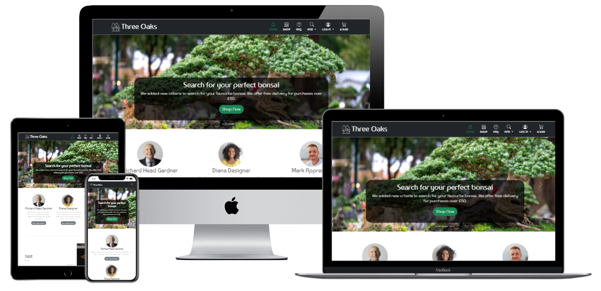](https://three-oaks.herokuapp.com/)

Click [here](https://three-oaks.herokuapp.com/) to live site.  
------

## UX

Three Oaks is designed in light airy style. Light background and light cards with slight shadow are used. The user is given plenty of choices which way to get to the shop from the home page - via navbar, via hero carousele button or via buttons below the team members. 

To make a purchase user can pay with a credit card as checkout page features stripe payments.

The user can also get involved in asking questions about bonsai and sign up to the newsletter. 

## Purpose

The app is designed as a e-commerce application that encourages the users to make a purchase


## User Stories

### User Stories that have been satisfied by creation of particular apps in ths project:

| id  |  content | how was it satisfied
| ------ | ------ | ------ |
|  [#1](https://github.com/JoGorska/bonsai-shop/issues/1) | As a Shopper I can register as a user and have ability to login so that my personal data is saved for future shopping | profile |
|  [#2](https://github.com/JoGorska/bonsai-shop/issues/2) | As a shopper I can see a list of products so that so I can view what shop can offer | trees app |
|  [#3](https://github.com/JoGorska/bonsai-shop/issues/3) | As a shopper I can sort the procucts by various categories so that I can find what I am looking for | trees app |
|  [#4](https://github.com/JoGorska/bonsai-shop/issues/4) | As a shopper I can add and remove items from my shopping trolley so that I can see how much I will spend | trolley app |
|  [#6](https://github.com/JoGorska/bonsai-shop/issues/6) | As a shopper I can have a search form so that find the product by name or description |trees app |
|  [#7](https://github.com/JoGorska/bonsai-shop/issues/7) | As a shopper I can remove items from shopping trolley so that I don't buy what I don't want | trolley app |
|  [#8](https://github.com/JoGorska/bonsai-shop/issues/8) | As a shopper I can increase quantity of products in my shopping trolley so that I can buy more products of the same kind |  trolley app |
|  [#9](https://github.com/JoGorska/bonsai-shop/issues/9) | As a shopper I can put in my card details so that I can pay for my goods | checkout app |
|  [#10](https://github.com/JoGorska/bonsai-shop/issues/10) | As a shopper I can have the payment processed so that pay for products |  checkout app |
|  [#11](https://github.com/JoGorska/bonsai-shop/issues/11) | As a shopper I can see order confirmation after checkout so that see what I bought |  checkout app |
|  [#12](https://github.com/JoGorska/bonsai-shop/issues/12) | As a shopper I can have my order processed correctly even if my internet breaks down mid transaction |  checkout app |
|  [#13](https://github.com/JoGorska/bonsai-shop/issues/13) | As a shopper I can receive an email confirmation of my purchase so that I have proof of purchase |  checkout app |
|  [#14](https://github.com/JoGorska/bonsai-shop/issues/14) | As a shopper I can access the website in a publicly accessible domain so that view the website | deployed to heroku |
|  [#15](https://github.com/JoGorska/bonsai-shop/issues/15) | As a shop owner I can add products to the shop so that the shop can have more variety available | trees app |
|  [#16](https://github.com/JoGorska/bonsai-shop/issues/16) | As a shop owner I can edit / update product so that the description and price is up to date | trees app |
|  [#17](https://github.com/JoGorska/bonsai-shop/issues/17) | As a shop owner I can delete product so that I remove products no longer available | trees app |
|  [#20](https://github.com/JoGorska/bonsai-shop/issues/20) | As a shopper I can read advice on trees so that learn something more | questions app |
|  [#21](https://github.com/JoGorska/bonsai-shop/issues/21) | As a shopper I can ask questions so that I learn more about product |  questions app |
|  [#22](https://github.com/JoGorska/bonsai-shop/issues/22) | As a shop owner I can respond to questions send to FAQ so that I share knowledge with shoppers | questions app |
|  [#23](https://github.com/JoGorska/bonsai-shop/issues/23) | As a shopper I can sign up for newsletter so that receive regular updates about new products and advice on bonsai sign up from carusele generating modal tick box and sign up when buying on checkout t... | newsletter app |
|  [#24](https://github.com/JoGorska/bonsai-shop/issues/24) | As a shop owner I can send out newsletter via email so that I keep shoppers updated with new products and give them advice on bonsai | newsletter app |
|  [#36](https://github.com/JoGorska/bonsai-shop/issues/36) | As a first time visitor I can see an interesting home page so that I can understand what shop sells and to be encouraged to make a purchase | home app |
|  [#42](https://github.com/JoGorska/bonsai-shop/issues/42) | As a mobile phone user I can see only the tiles that I want to use to filter trees so that my phone's screen isn't so full of icons write js to show and hide the filtering tiles and the sorti... | trees app |
|  [#48](https://github.com/JoGorska/bonsai-shop/issues/48) | As a user I can see messages from the shop so that I know if my item was added to bag or removed | trolley app |
|  [#49](https://github.com/JoGorska/bonsai-shop/issues/49) | As a shopper I can have a dedicated checkout app so that I can fill in my details to complete the purchase and see the summary of my trolley | checkout app |
|  [#52](https://github.com/JoGorska/bonsai-shop/issues/52) | As a returning customer I can have my details saved so that I don't have to re type my address every time | profile app |
|  [#110](https://github.com/JoGorska/bonsai-shop/issues/110) | As a newsletter subscriber I can have a link for unsubscribing so that unsubscribe from newsletter | newsletter app |
|  [#118](https://github.com/JoGorska/bonsai-shop/issues/118) | As a store owner I can switch quickly between published and unpublished questions so that I know what has been written on the same subject before | questions app

### User stories that are planned for next sprint

| id  |  content | 
| ------ | ------ |
|  [#34](https://github.com/JoGorska/bonsai-shop/issues/34) | As a shopper I can have my address auto filled after I typed my postcode so that I don't have to type all address manually |
|  [#18](https://github.com/JoGorska/bonsai-shop/issues/18) | As a store owner I can update the stock numbers so that the shoppers know if the product is available |
|  [#19](https://github.com/JoGorska/bonsai-shop/issues/19) | As a shop owner I can see who is interested in the product that have run out of stock so that I can order more products of this type |
|  [#32](https://github.com/JoGorska/bonsai-shop/issues/32) | As a user I can have interactive validation on input so that I can see if what I am writing is correct before submitting the form |
|  [#84](https://github.com/JoGorska/bonsai-shop/issues/84) | As a user I can see that I forgot to check subscription or privacy policy checkbox so that I can correct my mistake before the page is reloaded |
|  [#116](https://github.com/JoGorska/bonsai-shop/issues/116) | As a user that asked question in FAQ I can subscribe to newsletter after I asked the question so that receive answer in my email |

## Wireframes 

The general structure of the page was based on 1/3 proportions in many of it's features. Wireframes were created with [Balsamiq](https://balsamiq.com/wireframes/?gclid=Cj0KCQiAubmPBhCyARIsAJWNpiMYzrk_0rLzl3vgYKRLXwnX7rpqyQiUFdyt3xHGpRiHlZlozwO_pvcaAvUFEALw_wcB).

The whole of design has been saved in this [pdf file](README_docs/wireframes/wireframes.pdf). 

### Home page

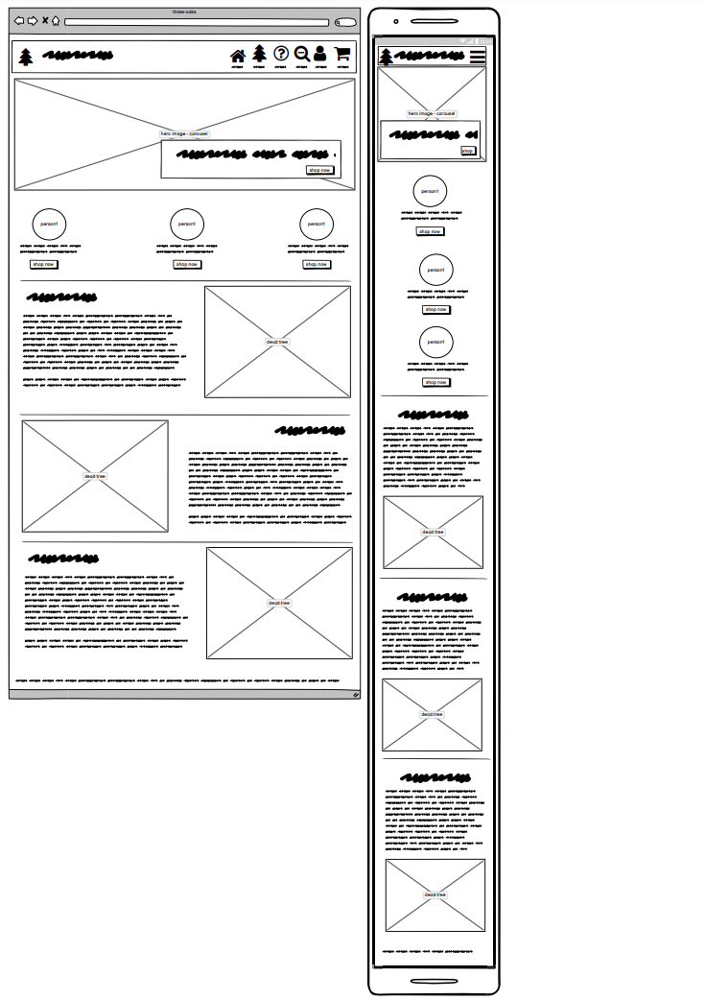
The desing of this page is heavily inspired by bootstrap examples found [here](https://getbootstrap.com/docs/4.0/examples/carousel/). This design was than further individualised to match the overal style of the page.

Home page is divided into three main sections: carousele, staff images and FAQ questions. This aims to give the user a feeling of dealing with real people and entice them to interesting content.

### Shop - trees app

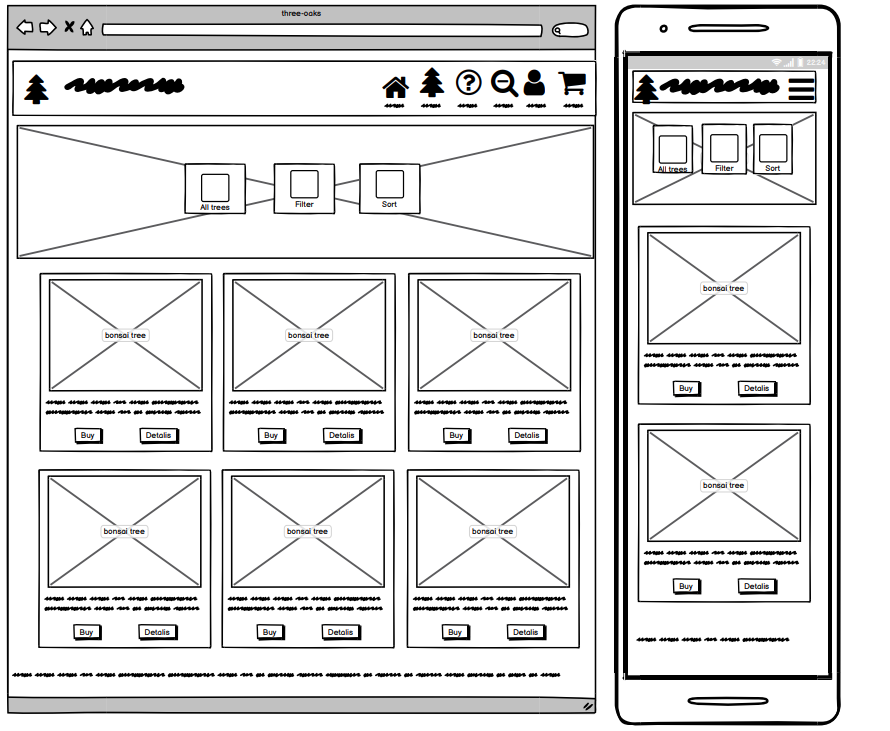

The trees app is divided into two main sections: the sorting/fitering tiles and the list of trees. 

Bootstrap grid was used for both of those features to make sure that all of the cards sets are responsive. 

Jquery script allows the user to choose the option to filter or sort the trees. On click of appropriate tiles, more tiles apear. 

Each card with the tree has been equipped with two buttons buy now and details.

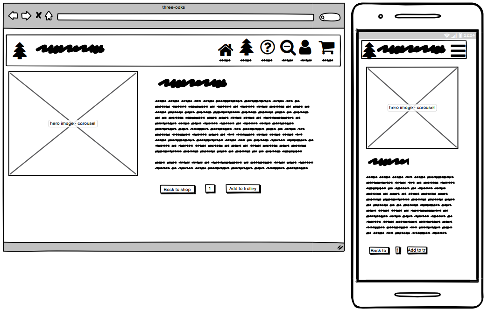

The trees detail cards were designed so the photo of the tree is nicely featured, but not overwelming. The features of the trees are extra visible thanks to icon and a badge effect arround each of them. The card is equipped with a buttons allowing user to purchase the tree.

### FAQ - questions app

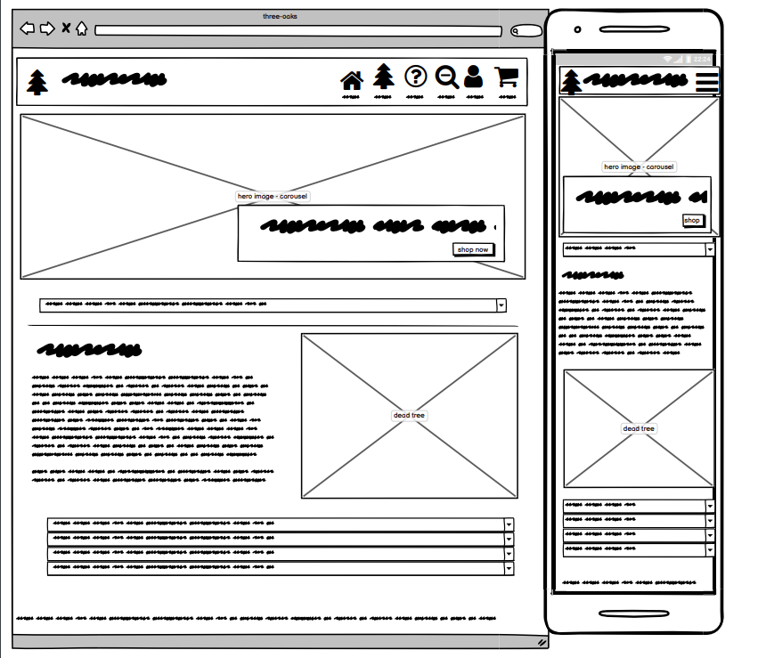

This page has been designed as a simple list view. Carousele features top part of the page and below it the user will find the list of published questions in the form of accordeon.

Once the accordeon is opened, the user can see the image and text refering to this question. 

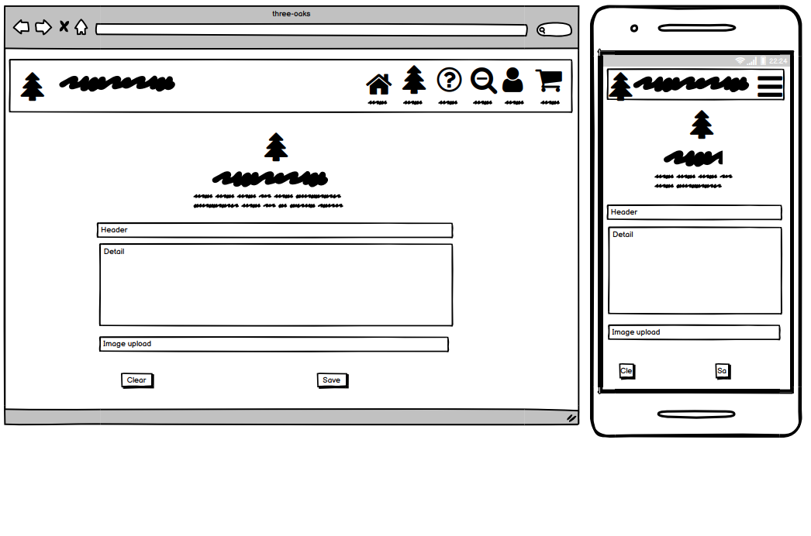

The form has been designed with minimal involvement in mind. It allows user just submit a few fields. They can choose to add image. Once the question is submitted it has to wait for superuser to add answer and change the status to published.

The same template is used to display the unpublished questions for the superuser to edit. Superuser is given the same form with some additional fields revieled like answer and status.

### Trolley app

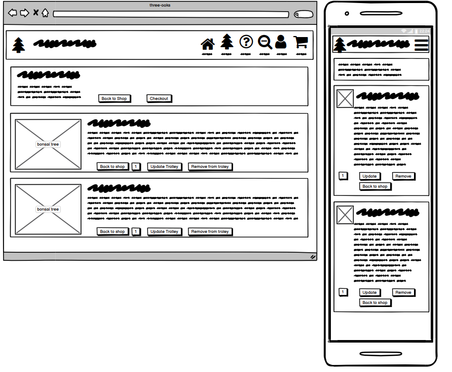

The trolley page has been designed similarly to amazon shopping bag. The summary of the order is right at the top of the page, whle the products are listed below inside a card with little image of each product. 

For mobile phone the image of the tree goes very small, but this is again in keeping with amazon styling - as it seems it is more user intuitive to have image and information side by side.

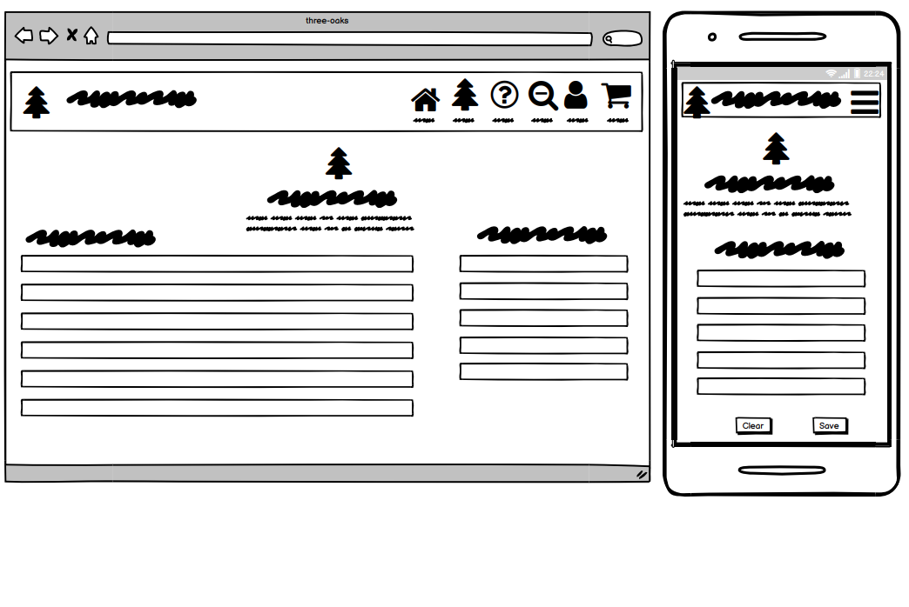

Checkout page has been inspired by bootstrap examples found [here](https://getbootstrap.com/docs/4.0/examples/checkout/) This gives the user a form on the left hand side and a very short summary of purchased items on the right hand side. 

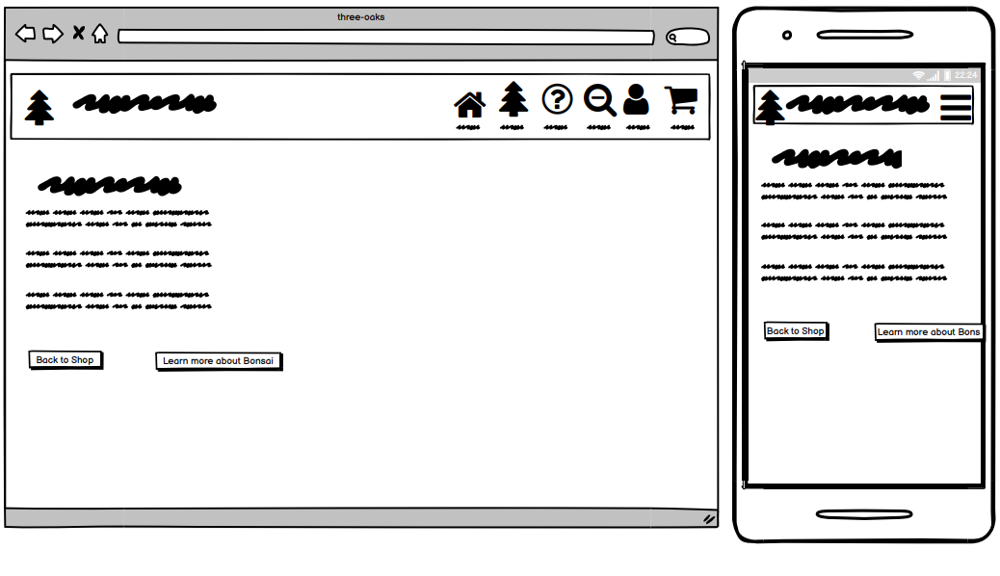

The order confirmation is a big card containing all relevant information about the purchase that has just been completed. The user is also notified by email that the purchase has been completed as well as by toast notification in the page.

### User app - allauth

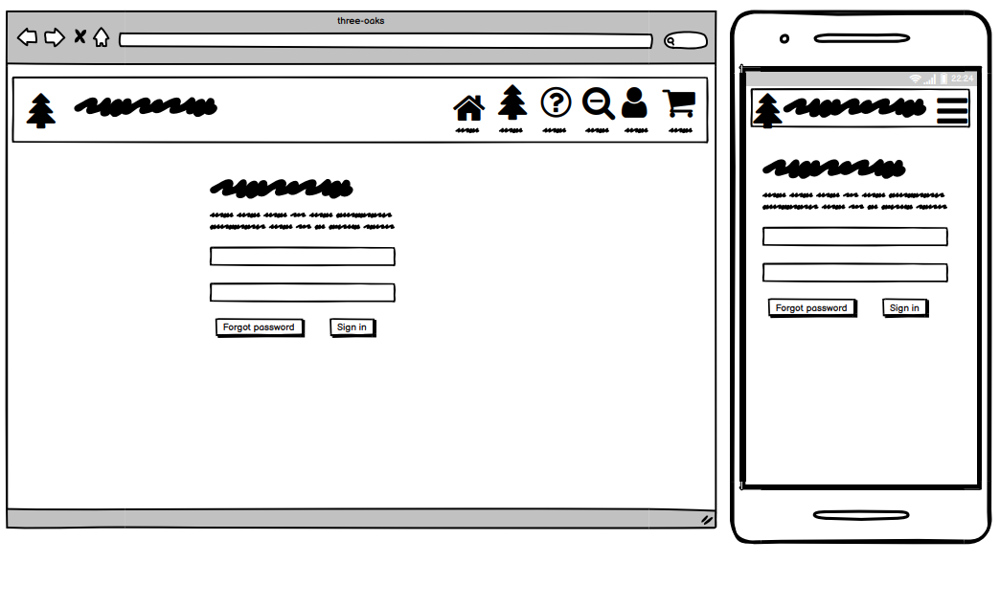

The allauth templates have been styled by bootstrap classes to match the general feel and design of the page. 

### Profile app
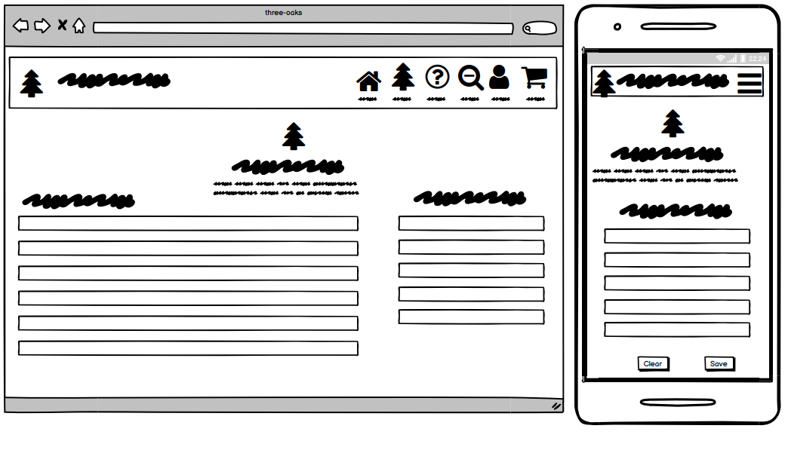

The profile app has been designed by using the same template as checkout app. The profile form is on the left and previous orders list is on the right.


### Agile Methodology

(link-to/canba)

Github issues were used to create the User stories and group them according to MoSCoW prioritization technique. Link to the project with live issues can be found [here](https://github.com/JoGorska/bonsai-shop/projects/1). The issues are currently in two categories - done or for the next relese. 

The issues were than closed automaticaly when the pull request was linked to the issue. 

## Existing Features
---


### Navbar and Footer

---
### Footer

---
### Home page 


---
### Shop


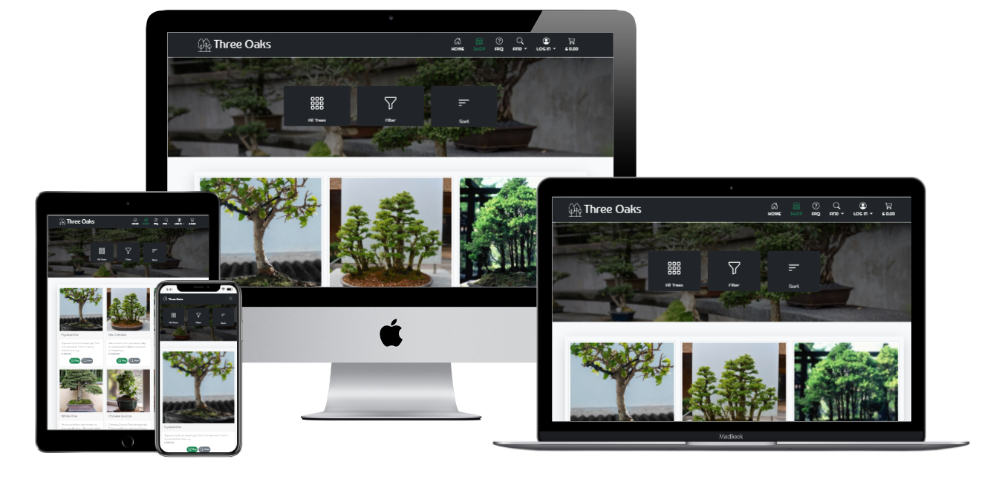

Currently shop features only trees. Future development might see adding bonsai tools added. Shop owner might also consider adding soil and fertilisers for bonsai trees. Next step might be to connect the fertilisers and soil with corresponding tree species to offer user all products he needs for his tree.

Shop features a hero image on the top overlayed with box shadow. This is so page doesn't seem empty. 

The set of tiles has been added on top of the hero image. The tiles act as a sorting and filtering menu. The grid has been taken from the [bootstrap icons page](https://icons.getbootstrap.com/). The tiles are purposed to resamble a dashboard that is so popular on mobile phones.

if javascript is written ???
The user has option to display only the tiles - buttons that are responsible for filtering or only the ones that sort products by given feature. This is to reduce the amount of icons displayed at the time. This can be overwelming especially for mobile phone users. 

All trees view
Cards shape, size and responsivness from bootstrap
each card is given two buttons buy and view. The buy button adds one item to the trolley. If item is alread in the trolley the button is changed to In trolley with checked symbol. This feature is to allow quick buying process. This enables user to buy an item without going inside to view the details of the tree. Unfortunately the content of the button In trolley breaks to two lines for devices above 800px and below 1000 px. 

### Shoping trolley

Free delivery thershold

I have been considering whether to create the free delivery threshold. It is hard to estimate the true delivery cost of the trees that are worth serveral thousand pounds. 

Some of the bonsai shops owners allow collection only - for the most expensive specimen. The good example  of this cen be found on Herons bonsai shop in the category High Quality Specimen Trees [here](https://www.herons.co.uk/Specimen-Trees/))

Having that said, the value of the most expensive specimen is set in an arbitrary manner and the shop owner can account for the cost of delivery and insurance within the price of the tree. 

I have decided to set the free delivery theshold at 50 just to use it as encouragement tool for first time buyers and small buyers to get them over the threshold line with just one more purchase. 

### FAQ

Shop owner can edit the question and set status to published so the question is displayed for the public includng the answer.

Unfortunately at this stage the superuser is able to edit Newsletter choice, which should not be the case. 

Further questionable might be that the superuser can edit the header and the details of the question but this is understandable as the shop owner might rewrite the question to get rid of any spelling errors or to make the question more clear to the reader. 


## Future Features 
------

### feature 1

### Dashboard for superuser

### search option in questions
It would be a great help if the user has been welcomed with a search form on FAQ page. This would let user search the library of our questions to see if someone has asked about the issue he is having. 

This would also limit repeating the same questions by other users. 


### switch button to switch between published and unpublished

### questions displayed in the same style as on home page, not as folded accordeon.

### Edit tree feature
The super user has an additional button showing up on a tree detail page to enale him to edit the dree. The user gets transfered to edit view and gets a pre filled form containing the current tree details. Both templates use the same form. The form is inserted as include into each template.

### Newsletter
Further developing the Subscriber model it needs adding a record who modified it last if it was registered user. This would allow to track if superuser hasn't changed subscribed status without prior authorisation from the Subscriber. 

Also as it has been revealed in bug section the Subscriber model needs long Slug with about 16 random ascii characters to build urls with it. One url for unsubscribe needs to remain unsecured from the back end as I am allowing unregistered users to subscribe.

The reason behind allowing this is some people are unlikely to register, but might be interested in the content of the page. This might entice them to register in the future. 

### Icons

The page uses icons intensively to make the content more intuitive. The icons have been sourced from Bootstrap icons and Fontawsome. In most cases icons have been used in svg format. All icon's paths have been copied into one file and than refferenced by id. On some occasions i element has been used to insert the icon. 

The icons are also used to ilustrate features of the tree and enviroments. The super user can add more features in the admin panel. The form will ask him to add the class for i element. 

This might be further developed to enable superuser to add features and enviroments from the website without going to admin panel.

### Buttons
To have unique styling of the page, the rounded-pill class is applied to all buttons. The rulle that green - is applied to all buttons that approve / save or submit information. Those buttons are placed to the right of all the other buttons. 

Buttons are usually equipped with an icon corresponding to the context. 

Links are often styled as a button to allow a nice flow of the page. 

## Search Engine Optimalization

SEO techniques were implemented to the best of my ability. I used keywords: bonsai, plants, bonsai trees, trees, bonsai advice, bonsai questions, bonsai ilnesses, bonsaid care, bonsai prices, 

Image alternative text is descriptive. Precaution measures are in place in case if shop owner doesn't add alt text, the template will get alt text from the tree name.

The site has been equipped with sitemap generated [here](https://www.xml-sitemaps.com/) and robots.txt. 

The site also has privacy policy and terms of service - both documents generated [here](https://policymaker.io/)

## Web Marketing

[facebook](https://www.facebook.com/Three-Oaks-Bonsai-Shop-104778752226022/)

### Newsletter
I've opted for creating a custom Newsletter model and not to use Mailchimp. The Page owner can send regular interesting content containing advice on bonsai to the subscribers. 


### Facebook


## Technologies Used
------

### Languages Used

   + HTML5
   + CSS3
   + JavaScript
   + jQuery
   + Python
   + Django

### Technologies and Programs Used:
+ GitHub
    The Git was used for version control
    Git issues were used for user stories
    GitPod was used as IDE to write the code and push to GitHub
+ Heroku 
    The page was deployed to Heroku
+ PostgreSQL
    PostgreSQL was used as database for this project
+ VSCode
    VSCode was used on the days when GitPod was down
+ Google Cloud
    to get api key
+ cloudinary storage
    for storing static files

 ### Frameworks Libraries and Programs Used

+ Balsamiq:
    Balsamiq was used to create the wireframes during the design process.
+ Bootstrap 5:
    Bootstrap was used to add style to the website.
+ Bootswach:
    Bootswatch wass added to change the standard styling and color pallette provided by bootstrap
+ Bootstrap icons
+ Django

## Code Validation
------

### HTML beautify

 [online HTML code Beautifier](https://htmlbeautify.com/). 

### HTML valiation

[HTML validator](https://validator.w3.org/nu/#textarea)


| Page  |  result
| ------ | ------ |
|  [Home](link/to/report |  No errors |
|  [another page](link/to/file.pdf)|No errors|


### CSS validation

[W3C validator](https://jigsaw.w3.org/css-validator/). The copy of the CSS report can be found [here](.....)

### JavaScript validation
Javascript code validation was complited on [jshint](https://jshint.com/)
Initialy it was returning errors in relation of ES6 syntax, which was resolved by adding this line to the beggining of the file
```
/*jshint esversion: 6*/
```

Second issue with jshint was that it wasn't recognizing syntax of JQuery. This was resolved by adding the below code:
```
/*globals $:false */
```

| Page  |  result
| ------ | ------ |
|  [script](link to result here /???) |  no errors |


### Python beautify
All pages were initialy put through [Python Formatter](https://codebeautify.org/python-formatter-beautifier) which automaticaly sorted most of the too long lines errors. Than the code was checked by pylint and problems were displayed in the console. Once the issues were cleared I have put all code though pep8 validator.

### Pep 8 

```
Python3 -m flake8
```
### Python validator


| App name  |  file name | result |
| ------ | ------ |------ |
| name-app|  urls.py |  [all ok](link.here.txt???) |
| users |  admin.py |  [all ok](??) |
| users |  forms.py |  [all ok](???) |
| users |  models.py |  [all ok](???) |
| users |  urls.py |  [all ok](??) |
| users |  views.py |  [all ok](???) |


## Tests
------

### Automated tests

Automated tests have not been created due to time constrains of the project.

### Lighthouse


### Manual tests

#### First release

**Relese main fetures:**

first set of 3rd party tests was performend by Daisy 
questions were in a form of accordeon, which required to click into by the user. It does not seem much inviting. I decided to follow the styling from the home page and display the questions in an open format. 


- styling issue with checkbox dropping down the line
- different size of sorting tiles in trees
- she didn't notice the option to add the questions that was set inside carouselle. I decided to render only one slide of the carouselle for the faq page so it becomes obvious to the user that they can read the questions or add the question themselves


## Project Bugs and Solutions:
------
### Grid with filtering and sorting icons
- allow user to choose filter or sort - this makes the smaller amount of icons displayed at once
- the grid breaks in a bit uncontrolled way, but it allows displaying the filters in a dynamic way.
- user can add more features to database with svg icon

filter - for li with class filters - display

sort - for li with class sort - display

for loop in features to display tiles and build links dynamically

### Button In trolley on all trees view

The content of the button In trolley and View breaks to two lines for devices above 800px and below 1000 px. 

This only breaks in cards for the treees that area already in the trolley. The longer text "in trolley" is more descriptive that just the word Trolley or "in bag" as I use trolley in this application. 

I might need to address this issue with media query. I might also leave it as it is visibly different that the trees that are not in the bag yet and might look more inviting to click to go to the trolley and than to checkout. 


### checkbox not in line with label for some screen widths

### faq questions form

can I prevent superuser from editing newsletter choice? Yes - by setting - if superuser - input type  = hidden, but the superuser can still go to admin panel and change this. I can also edit it in the dev tools - as input type hidden is visible there. 

It would have to be protected in the back end from saving by superuser. There must be a way of setting different levels of access. It might be safer for the store owner not to be superuser will access to django admin panel, only to access 99% of crud functionality of all models - with this small exception. There is not enough time for me to explore this possiblity. 

preventing normal user from editing draft status to published - currently it is input type hidden. It might be safer to add this in the back end. Before the form is validated.

I've tested if I can edit published status from chrome dev tools. I logged in as a normal user and inspected the hidden input for status. I updated it to 1 (published) and it has submitted form and published the question. 

The status input should not be displayed as input hidden, the same with user, as it can be very simply edited. This should be added to the form instance in the view before the form is validated. 


### FAQ questions form creating Subscriber

can I make it create subscriber

I need to check if user is subscribed.

### caruselle
- in faq it should only display add question
- on home - it should vary the button if the user is subscribed

### FAQ Newsletter

Shop owner has the ability to set Newsletter to sign me up for any of the users. This could be resolved by checking if the user is author both in the template as well as in the view, before saving the instance of the form. This way the whole form except of newsletter field could be saved. I would have to state explicitly which fields should be saved. 

## Bugs still there


### handling unsubscribing

I created 2 different views to handle unsubscribe, this should have been done in a simpler way. 

Now I realised that I need to make another view for unsubscribing users, so user can unsubscribe with one click from the email. This should be a view not requiring a login, otherwise the proces of unsubscribing becomes a bit iritating. 

Having that said, an url that would unsubscribe users, that wouldn't require sign up is open to attacks, as any person could start unsubscribing random users knowing url pattern. 

Since some of the subscribers might not be actually registered users, it will need to be a view without logging in decorator.

It would make malicious unsubscribe actions very difficult if URL was desingned with some complex slug. Each subscriber should have their slug with som random ascii characters. This way it would be highly unlikely that a third party could guess url for unsubscribing. 

### Unsecure url for unsubscribing from newsletter

One of the urls for unsubscribing from newsletter in newsletter app had to be left without being secured in the back end. This is because I allow to add email to Subscribers for visitors that are not registered users.

I had to have a url for unsubscribing those un registered users. I add this url dynamically at the end of newsletter email adding un registered users a chance to unsubscribe if they choose to.

I have realised that this url is far too simple. This allows malicious unsubscribing just by changing a number at the end of this url.

The solution that would give a minimal security would be to add a Slug to Subscriber model that would be generated automaticaly for each subscriber. I would use similar random string generator as in the Tree model to generate random characters to add to slug. 
```
def random_string_generator(self, size=16, chars=string.ascii_lowercase + string.digits):
        return "".join(random.choice(chars) for _ in range(size)) 
```

Slug would be automaticaly generated each time a new Subscrier is added. The URL for unsubscribing should be build with using slug, not subscriber ID. This would make unsecure url a bit harder to access. 

Unfortunately I realised this unsecurity too late in the project and I didn't want to risk making big changes in models. Deleting this view and url because it is unsecure, would deprive unregistered users from ability to unsubscribe. 

All these problems would not be the case if I have had limited the Subscribers to registered users only. The reason behind allowing this is some people are unlikely to register, but might be interested in the content of the page. This might entice them to register in the future. 

### Addressing email to the registered user

Each subscriber is saved with registered_user column item saved as None or as username of the user if the user was logged in at the time of signing up. 

It would be great to use this relational key and address each email individualy. 

### sorting tiles uneven on tablets

some diferences in height of sorting tiles in comparing to filtering tiles for medium screen witdh (tablets)

also tiles on mobiles become different length if the tile description contains two words. 

### FAQ form - normal user can change status to published


### superuser can change newsletter status

This poses a field for abuse, as superuser can easily add users to newsletter without their consent. 

Superuser can change the newsletter status - both on Subscriber model and on Newsletter model. This can be done by accessing django admin model or editin the input type hidden in dev tools before the form submittion. 

This can be resolved by setting different access level for store owner, instead of giving him superuser.  

### Question seems to change author after editing

The questions have been posted by regular users. It seems that after the super user has edited the question and added the answer, the author is updated to superuser. Need to change model. 
  1. author - oryginal author of the question
  2. editor - the user that has edited the question last. 

As a temporary fix I changed the hidden input that was adding the author to the form to "question.author.id" so the item is being saved with the oryginal author in place"


### Bootstrap's toasts floating left outside the 320px wide screens

I've noticed that all toast messages float left outside the 320px wide screens. I have tried a few different classes to move the toast in the view. Nothing seemed to work. I've gone back to bootstrap 5 toasts examples page and I triggered the example toast [here](https://getbootstrap.com/docs/5.0/components/toasts/#live) - the behaviour was identical. It floats left outside the screen. Since bootstrap makers have not fixed this issue I don't think I will manage this at this stage. 

The solution might be styling width of toast only slightly smaller - which would make them fit inside the smallest mobiles. Another solution would me fix position a little different, although changing this property resulted in toast floating outside the screen the other side. I can't seem to get rid of the gap between the border of the toast and the edge of the screen.

### ununified comments - end of container and others

Some comments were inherited from bootstrap examples. For example the below code is from bootstrap carousele
```
    <!-- /END THE FEATURETTES -->
  </div>
  <!-- /.container -->
```

I used comments to end some container when container was very complex and had a few else / if statements inside it. I would be good to unify the styling of comments. 

## Deployment and making a clone

### Deployment to heroku

**In your app** 

1. add the list of requirements by writing in the terminal "pip3 freeze --local > requirements.txt"
2. Git add and git commit the changes made

**Log into heroku**

3. Log into [Heroku](https://dashboard.heroku.com/apps) or create a new account and log in

4. top right-hand corner click "New" and choose the option Create new app, if you are a new user, the "Create new app" button will appear in the middle of the screen

5. Write app name - it has to be unique, it cannot be the same as this app
6. Choose Region - I am in Europe
7. Click "Create App"

**The page of your project opens.**

8. Go to Resources Tab, Add-ons, search and add Heroku Postgres

9. Choose "settings" from the menu on the top of the page

10. Go to section "Config Vars" and click button "Reveal Config Vars". 

11. Add the below variables to the list

    * Database URL will be added automaticaly
    * Secret_key - is the djnago secret key can be generated [here](https://miniwebtool.com/django-secret-key-generator/). 


**Go back to your code**

12. Procfile needs to be created in your app
```
web: gunicorn PROJ_NAME.wsgi
```

13. In settings in your app add Heroku to ALLOWED_HOSTS

14. Add and commit the changes in your code and push to github

**Final step - deployment**

15. Next go to "Deploy" in the menu bar on the top 

16. Go to section "deployment method", choose "GitHub"

17. New section will appear "Connect to GitHub" - Search for the repository to connect to

18. type the name of your repository and click "search"

19. once Heroku finds your repository - click "connect"

20. Scroll down to the section "Automatic Deploys"

21. Click "Enable automatic deploys" or choose "Deploy branch" and manually deploy

22. Click "Deploy branch"

Once the program runs:
you should see the message "the app was sussesfully deployed"

23. Click the button "View"

The live link can be found [here](live/page/here/???).

### Forking the GitHub Repository

By forking the GitHub Repository you will be able to make a copy of the original repository on your own GitHub account allowing you to view and/or make changes without affecting the original repository by using the following steps:

1. Log in to GitHub and locate the [GitHub Repository](repo here???)
2. At the top of the Repository (not top of page) just above the "Settings" button on the menu, locate the "Fork" button.
3. You should now have a copy of the original repository in your GitHub account.

### Making a Local Clone

1. Log in to GitHub and locate the [GitHub Repository](repo here???)
2. Under the repository name, click "Clone or download".
3. To clone the repository using HTTPS, under "Clone with HTTPS", copy the link.
4. Open commandline interface on your computer
5. Change the current working directory to the location where you want the cloned directory to be made.
6. Type `git clone`, and then paste the URL you copied in Step 3.

```
$ git clone http..repo here???
```

7. Press Enter. Your local clone will be created.

### Setting up your local enviroment

1. Create Virtual enviroment on your computer or use gitpod built in virtual enviroment feature.

2. Create env.py file. It needs to contain those 5 variables.

* Database URL can be obtained from [heroku](https://dashboard.heroku.com/), add PostgreSQL as an add on when creating an app. 
* Secret_key - is the djnago secret key can be generated [here](https://miniwebtool.com/django-secret-key-generator/). 
* Cloudinary URL can be obtained from [cloudinary](https://cloudinary.com/) follow the steps on the website to register. 
* Google API key can be obtained [here](https://cloud.google.com/gcp?authuser=1) you will have to register with google and create new app to get the API key. Follow the instructions on the website.

```
DEVELOPMENT
SECRET_KEY

STRIPE_PUBLIC_KEY
STRIPE_SECRET_KEY 
STRIPE_WH_SECRET

```
PostgreSQL and AWS keys are needed only on Heroku, not in local IDE

3. Run command 
```
pip3 install -r requirements.txt
```


### Getting Stripe keys
Go to developers tab. On side menu you will find API keys. Copy STRIPE_PUBLIC_KEY and STRIPE_SECRET_KEY.

Go to Webhooks. Click Add Endpoint button in top right hand corner.
Add endpoint URL (your local or deployed URL)
Add all events 
Than click add endpoint
You should be redirected to this webhook's page. Reveal webhook sign in secret and copy to Settings and to heroku as STRIPE_WH_SECRET variable

### Getting email variables from gmail


- Log into gmail account
- Go to Settings and than See all settings
- Top menu go to Accounts and import
- Find on the list Other google account settings
- Left side menu - Security
- Turn on two step verification: add phone number and follow instructions
- Go back to security
App passwords - Select Mail, Select Device - Other, Django, Copy app password.

In Heroku 
EMAIL_HOST_PASS is the password copied from above.
EMAIL_HOST_USER is the gmail email address


### Setting AWS bucket


1. Go to [Amzon Web Services](https://aws.amazon.com/) page and login or register

2. You should be redirected to AWS Managment Console, if not click onto AWS logo in top left corner or click Services icon and choose Console Home

3. Below the header AWS Services click into All Services and find **S3** under Storage

4. Create New Bucket using **Create Bucket** button in top right hand corner

- **Configuration:** type in your chosen name for the bucket (preferably matching your heroku app name) and AWS Region closest to you


- **Object ownership:** ACLs enabled, Bucket owner preffered

- **Block Public Access settings:** Uncheck to allow public access, Acknowledge that the current settings will result that the objects within the bucket will become public

- Click **Create Bucket**

5. You are redirected to Amazon S3 with list of your buckets. Click into the name of the bucket you just created

6. Find the tab **Properties** on the top of the page:
**Static website hosting** at the bottom of the properties page: clik to edit, click enable, fill in index document: index.html and error.html for error

7. On the **Permissions** tab:
- Cross-origin resource sharing (**CORS**) Paste in the below code as configuration and save

```
[
  {
      "AllowedHeaders": [
          "Authorization"
      ],
      "AllowedMethods": [
          "GET"
      ],
      "AllowedOrigins": [
          "*"
      ],
      "ExposeHeaders": []
  }
]
```
- **Bucket Policy** within permissions tab: Edit bucket policy
Click AWS Policy Generator (top right conrner)

Select type of policy: S3 Bucket policy
Principal: * (allows all)
Actions: Get object
Amazon Resource Name (ARN): paste from the Edit bucket policy page in permissions
Click Add statement Than Click Generate Policy and Copy the policy into bucket policy editor. 
In the policy code find "Resource" key and add "/*" after the name of the bucket to enable all
Save changes

- **Access control list (ACL)** within permissions tab: click Edit

find Everyone (public access) and check List box and save

8. Identity and Access Management (IAM)
Go back to the AWS Management Console and find IAM in AWS Services

- side menu - User Groups and click **Create Group**
name group "manage-your-app-name" and click Create group

- side menu - Policies and click **Create Policy**
Click import managed policy - find AmazonS3FullAccess
Copy ARN again and paste into "Resource" add list containint two elements "[ "arn::..", ""arn::../*]" First element is for bucket itself, second element is for all files and foldrs in the bucket

Click bottom right Add Tags, than Click bottom right Next: Review
Add name of the policy and description

Click bottom right Create policy

9. Attach policy to the group we created:
- go to User Groups on side menu
- select your group from the list
- go to permissions tab and add permissions drop down and choose **Attach policies**
- find the policy created above and click button in bottom right Add permissions

10. Create User to go in the group
- **Users** in the side menu and click add users

User name: your-app-staticfiles-user
Check option: Access key - Programmatic access
Click button at the bottom right for Next
- Add user group and add user to the group you created earlier
Click Next Tags and Next: review and Create user
- Download .csv file


11. Connect django to AWS S3 bucket
- install boto3
- install django-storages
- freeze to requirements.txt
- add storages to installed apps in settings.py

```
if 'USE_AWS' in os.environ:
    # Cache control
    AWS_S3_OBJECT_PARAMETERS = {
        'Expires': 'Thu, 31 Dec 2099 20:00:00 GMT',
        'CacheControl': 'max-age=94608000',
    }

    # Bucket Config
    AWS_STORAGE_BUCKET_NAME = os.getenv('AWS_STORAGE_BUCKET_NAME')
    AWS_S3_REGION_NAME = 'eu-west-2'
    AWS_ACCESS_KEY_ID = os.getenv('AWS_ACCESS_KEY_ID')
    AWS_SECRET_ACCESS_KEY = os.getenv('AWS_SECRET_ACCESS_KEY')
    AWS_S3_CUSTOM_DOMAIN = f'{AWS_STORAGE_BUCKET_NAME}.s3.amazonaws.com'
```

12. Go to heroku to set up enviromental variables

open CSV file downloaded earlier and copy each variable into heroku Settings

AWS_STORAGE_BUCKET_NAME
AWS_ACCESS_KEY_ID from csv
AWS_SECRET_ACCESS_KEY from csv
USE_AWS = True
remove DISABLE_COLLECTSTATIC variable from heroku

13. Create file in root directory custom_storages.py

```
from django.conf import settings
from storages.backends.s3boto3 import S3Boto3Storage


class StaticStorage(S3Boto3Storage):
    location = settings.STATICFILES_LOCATION


class MediaStorage(S3Boto3Storage):
    location = settings.MEDIAFILES_LOCATION
```

14. Go to settings.py, add the AWS settings

```
    # Static and media files
    STATICFILES_STORAGE = 'custom_storages.StaticStorage'
    STATICFILES_LOCATION = 'static'
    DEFAULT_FILE_STORAGE = 'custom_storages.MediaStorage'
    MEDIAFILES_LOCATION = 'media'

    # Override static and media URLs in production
    STATIC_URL = f'https://{AWS_S3_CUSTOM_DOMAIN}/{STATICFILES_LOCATION}/'
    MEDIA_URL = f'https://{AWS_S3_CUSTOM_DOMAIN}/{MEDIAFILES_LOCATION}/'

```

15. To load the media files to S3 bucket

- Go to your S3 bucket page on AWS. Create new folder "media"
- go to the media folder and click Upload


## Credits 
### Online resources
* [Icons8](https://icons8.com/)
* [unsplash](https://unsplash.com/)
* [Fontawsome](https://fontawesome.com/)
* [Bootstrap 5]()
* [Markdown best practices](https://www.markdownguide.org/basic-syntax/)
* [Markdown Table of content generator](http://ecotrust-canada.github.io/markdown-toc/)

* [icon](<a href="https://www.flaticon.com/free-icons/trees" title="trees icons">Trees icons created by Freepik - Flaticon</a>)
* png to svg [converter](https://convertio.co/download/d39aa7f30e79f4379b9bce697c5afe384b5853/)
* resizing photos by [photoresizer](https://www.photoresizer.com/)

### Tutorials and inspiration

* The project walkthrough 

* [Herons Bonsai](https://www.herons.co.uk/)
* [starter template](https://getbootstrap.com/docs/5.0/getting-started/introduction/) from bootstrap 5
* base template from [bootstrap examples](https://getbootstrap.com/docs/5.0/examples/carousel/)

* 

### People